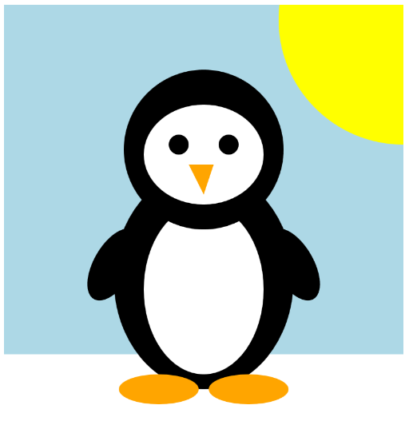
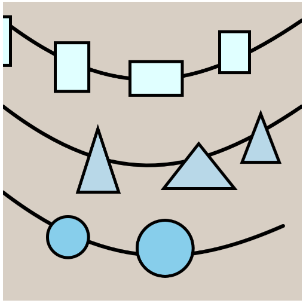
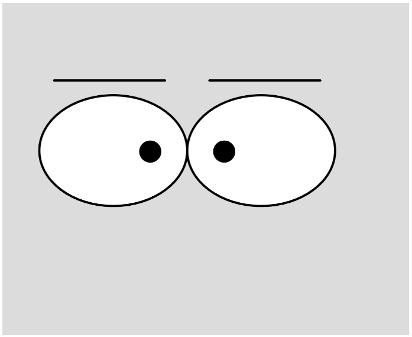
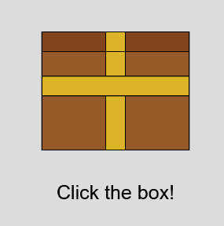
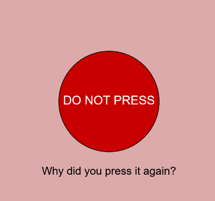
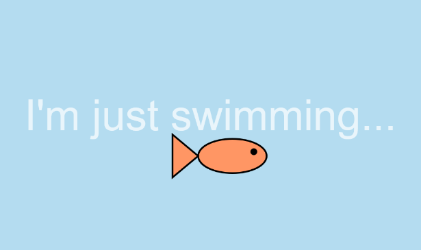

# **CART253 REPO (FALL 2026)**

## **Reflective Journal Link**
- *[Link to reflective journal](https://github.com/AlejandroBrnab/cart253/blob/main/ReflectiveJournal.md)* *:)*
- *[Link to reflective journal for latest assignment](https://github.com/AlejandroBrnab/cart253/blob/main/ReflectiveJournal.md#2026-10-07)*

# **Description**
This is a coursework repo. More projects/prototypes will be added to this website (as links leading to those projects) and this website may change even more in the future.

## **Additional Links**
Some other links leading to other stuff.

- *[Link to see the website](https://alejandrobrnab.github.io/cart253/)* *:D*

## **Prototypes**
### Penguin Prototype:
- *[View online](https://alejandrobrnab.github.io/cart253/topics/prototypes/instructions/instructions-prototype-1/index.html)*
- *[View code](https://github.com/AlejandroBrnab/cart253/tree/main/topics/prototypes/instructions/instructions-prototype-1)*

### Abstract Prototype:
- *[View online](https://alejandrobrnab.github.io/cart253/topics/prototypes/instructions/instructions-prototype-2/index.html)*
- *[View code](https://github.com/AlejandroBrnab/cart253/tree/main/topics/prototypes/instructions/instructions-prototype-2)*

### weIrD Prototype:
- *[View online](https://alejandrobrnab.github.io/cart253/topics/prototypes/instructions/instructions-prototype-3/index.html)*
- *[View code](https://github.com/AlejandroBrnab/cart253/tree/main/topics/prototypes/instructions/instructions-prototype-3)*

### Candle Prototype:
- *[View online](https://alejandrobrnab.github.io/cart253/topics/prototypes/variables/variables-prototype-1/index.html)*
- *[View code](https://github.com/AlejandroBrnab/cart253/tree/main/topics/prototypes/variables/variables-prototype-1)*

### Eyes Prototype:
- *[View online](https://alejandrobrnab.github.io/cart253/topics/prototypes/variables/variables-prototype-2/index.html)*
- *[View code](https://github.com/AlejandroBrnab/cart253/tree/main/topics/prototypes/variables/variables-prototype-2)*

### Magnets Prototype
- *[View online](https://alejandrobrnab.github.io/cart253/topics/prototypes/variables/variables-prototype-3/index.html)*
- *[View code](https://github.com/AlejandroBrnab/cart253/tree/main/topics/prototypes/variables/variables-prototype-3)*

### Mystery Box Prototype
- *[View online](https://alejandrobrnab.github.io/cart253/topics/prototypes/variables/conditionals-prototype-1/index.html)*
- *[View code](https://github.com/AlejandroBrnab/cart253/tree/main/topics/prototypes/variables/conditionals-prototype-1)*

### Button Prototype
- *[View online](https://alejandrobrnab.github.io/cart253/topics/prototypes/variables/conditionals-prototype-2/index.html)*
- *[View code](https://github.com/AlejandroBrnab/cart253/tree/main/topics/prototypes/variables/conditionals-prototype-2)*

### Fish Prototype
- *[View online](https://alejandrobrnab.github.io/cart253/topics/prototypes/variables/conditionals-prototype-3/index.html)*
- *[View code](https://github.com/AlejandroBrnab/cart253/tree/main/topics/prototypes/variables/conditionals-prototype-3)*

