# **CART253 REPO (FALL 2026)**

## **Reflective Journal Link**
- *[Link to general reflective journal](https://github.com/AlejandroBrnab/cart253/blob/main/ReflectiveJournal.md)* *:)*

# **Description**
This is a coursework repo. More projects/prototypes will be added to this website (as links leading to those projects) and this website may change even more in the future.

## **Additional Links**
Some other links leading to other stuff.

- *[Link to see the website](https://alejandrobrnab.github.io/cart253/)* *:D*

## **Prototypes**
### **Intructions**

- *[Link to reflective journal](https://github.com/AlejandroBrnab/cart253/blob/main/ReflectiveJournal.md#2026-09-23)*

#### Penguin Prototype:
- *[View online](https://alejandrobrnab.github.io/cart253/topics/prototypes/instructions/instructions-prototype-1/index.html)*
- *[View code](https://github.com/AlejandroBrnab/cart253/tree/main/topics/prototypes/instructions/instructions-prototype-1)*

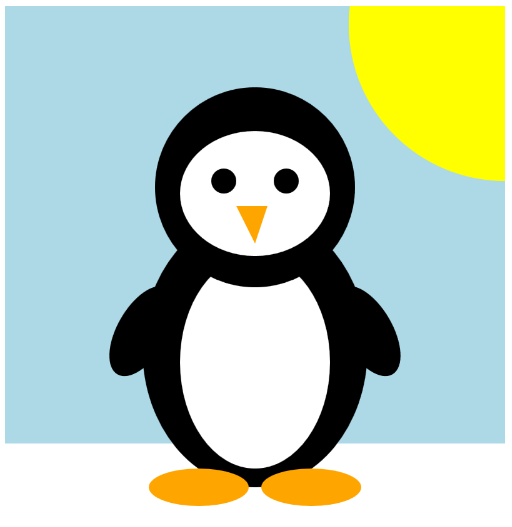

#### Abstract Prototype:
- *[View online](https://alejandrobrnab.github.io/cart253/topics/prototypes/instructions/instructions-prototype-2/index.html)*
- *[View code](https://github.com/AlejandroBrnab/cart253/tree/main/topics/prototypes/instructions/instructions-prototype-2)*

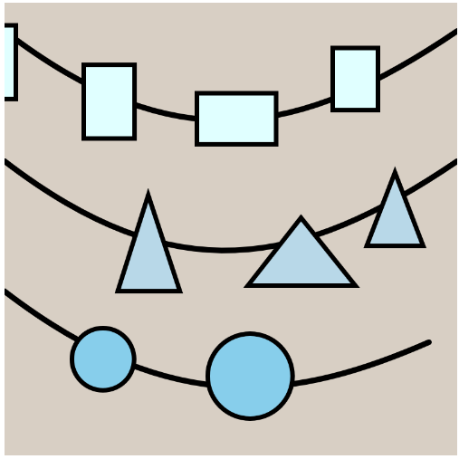

#### weIrD Prototype:
- *[View online](https://alejandrobrnab.github.io/cart253/topics/prototypes/instructions/instructions-prototype-3/index.html)*
- *[View code](https://github.com/AlejandroBrnab/cart253/tree/main/topics/prototypes/instructions/instructions-prototype-3)*

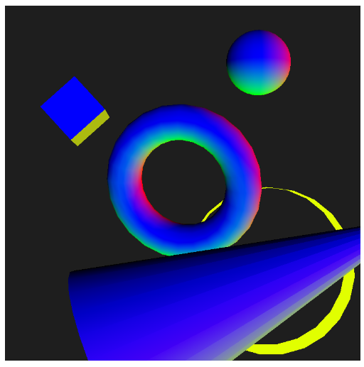

### **Variables**

- *[Link to reflective journal](https://github.com/AlejandroBrnab/cart253/blob/main/ReflectiveJournal.md#2026-09-30)*

#### Candle Prototype:
- *[View online](https://alejandrobrnab.github.io/cart253/topics/prototypes/variables/variables-prototype-1/index.html)*
- *[View code](https://github.com/AlejandroBrnab/cart253/tree/main/topics/prototypes/variables/variables-prototype-1)*

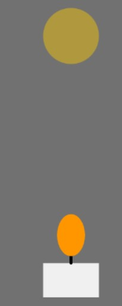

#### Eyes Prototype:
- *[View online](https://alejandrobrnab.github.io/cart253/topics/prototypes/variables/variables-prototype-2/index.html)*
- *[View code](https://github.com/AlejandroBrnab/cart253/tree/main/topics/prototypes/variables/variables-prototype-2)*

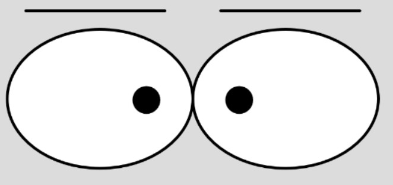

#### Magnets Prototype
- *[View online](https://alejandrobrnab.github.io/cart253/topics/prototypes/variables/variables-prototype-3/index.html)*
- *[View code](https://github.com/AlejandroBrnab/cart253/tree/main/topics/prototypes/variables/variables-prototype-3)*

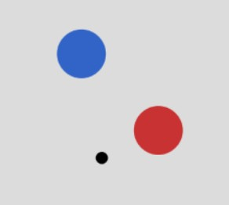

### **Conditionals**

- *[Link to reflective journal](https://github.com/AlejandroBrnab/cart253/blob/main/ReflectiveJournal.md#2026-10-07)*

#### Mystery Box Prototype
- *[View online](https://alejandrobrnab.github.io/cart253/topics/prototypes/conditionals/conditionals-prototype-1/index.html)*
- *[View code](https://github.com/AlejandroBrnab/cart253/tree/main/topics/prototypes/conditionals/conditionals-prototype-1)*

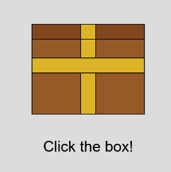

#### Button Prototype
- *[View online](https://alejandrobrnab.github.io/cart253/topics/prototypes/conditionals/conditionals-prototype-2/index.html)*
- *[View code](https://github.com/AlejandroBrnab/cart253/tree/main/topics/prototypes/conditionals/conditionals-prototype-2)*

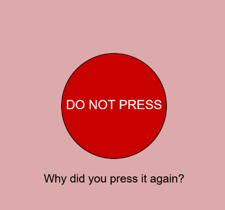

#### Fish Prototype
- *[View online](https://alejandrobrnab.github.io/cart253/topics/prototypes/conditionals/conditionals-prototype-3/index.html)*
- *[View code](https://github.com/AlejandroBrnab/cart253/tree/main/topics/prototypes/conditionals/conditionals-prototype-3)*

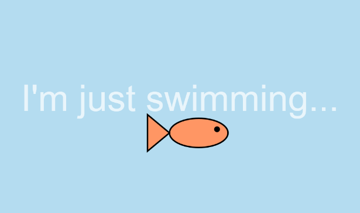

### **Events**

- *[Link to reflective journal](https://github.com/AlejandroBrnab/cart253/blob/main/ReflectiveJournal.md#2026-10-19)*

#### Word Reveal Game Prototype
- *[View online](https://alejandrobrnab.github.io/cart253/topics/prototypes/events/events-prototype-1/index.html)*
- *[View code](https://github.com/AlejandroBrnab/cart253/tree/main/topics/prototypes/events/events-prototype-1)*

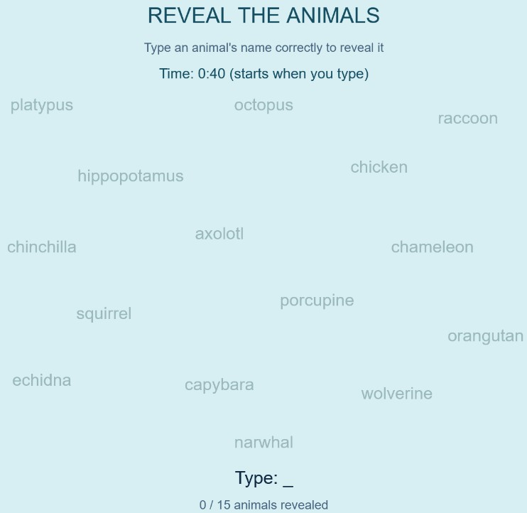

#### Reaction Time Prototype 
- *[View online](https://alejandrobrnab.github.io/cart253/topics/prototypes/events/events-prototype-2/index.html)*
- *[View code](https://github.com/AlejandroBrnab/cart253/tree/main/topics/prototypes/events/events-prototype-2)*

#### Tab Switch Prototype
- *[View online](https://alejandrobrnab.github.io/cart253/topics/prototypes/events/events-prototype-3/index.html)*
- *[View code](https://github.com/AlejandroBrnab/cart253/tree/main/topics/prototypes/events/events-prototype-3)*

### **Functions**

- *[Link to reflective journal](https://github.com/AlejandroBrnab/cart253/blob/main/ReflectiveJournal.md#2026-10-29)*

#### Shape Painter Prototype
- *[View online](https://alejandrobrnab.github.io/cart253/topics/prototypes/functions/functions-prototype-1/index.html)*
- *[View code](https://github.com/AlejandroBrnab/cart253/tree/main/topics/prototypes/functions/functions-prototype-1)*

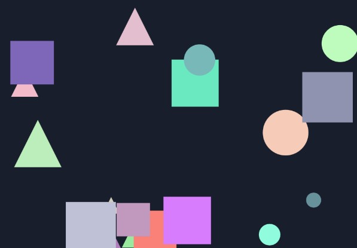

#### Counting Stars Prototype
- *[View online](https://alejandrobrnab.github.io/cart253/topics/prototypes/functions/functions-prototype-2/index.html)*
- *[View code](https://github.com/AlejandroBrnab/cart253/tree/main/topics/prototypes/functions/functions-prototype-2)*

#### Hunger Games Prototype
- *[View online](https://alejandrobrnab.github.io/cart253/topics/prototypes/functions/functions-prototype-3/index.html)*
- *[View code](https://github.com/AlejandroBrnab/cart253/tree/main/topics/prototypes/functions/functions-prototype-3)*

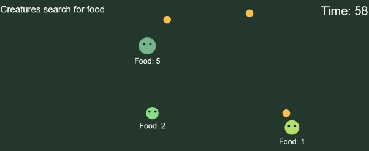

### **Arrays**

- *[Link to reflective journal](https://github.com/AlejandroBrnab/cart253/blob/main/ReflectiveJournal.md#2026-11-03)*

#### Ball Pit Prototype
- *[View online](https://alejandrobrnab.github.io/cart253/topics/prototypes/arrays/arrays-prototype-1/index.html)*
- *[View code](https://github.com/AlejandroBrnab/cart253/tree/main/topics/prototypes/arrays/arrays-prototype-1)*

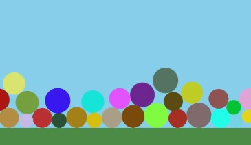

#### New World Reveal Game Prototype
- *[View online](https://alejandrobrnab.github.io/cart253/topics/prototypes/arrays/arrays-prototype-2/index.html)*
- *[View code](https://github.com/AlejandroBrnab/cart253/tree/main/topics/prototypes/arrays/arrays-prototype-2)*

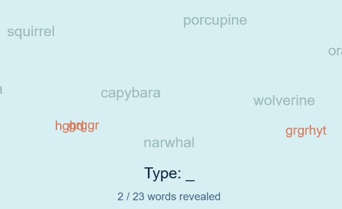

#### Tiny Aquarium Prototype
- *[View online](https://alejandrobrnab.github.io/cart253/topics/prototypes/arrays/arrays-prototype-3/index.html)*
- *[View code](https://github.com/AlejandroBrnab/cart253/tree/main/topics/prototypes/arrays/arrays-prototype-3)*

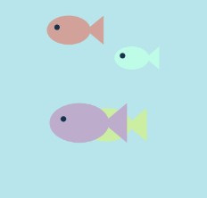