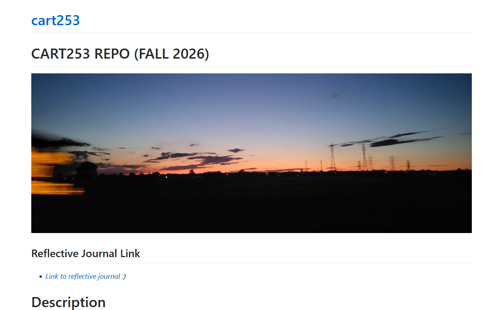
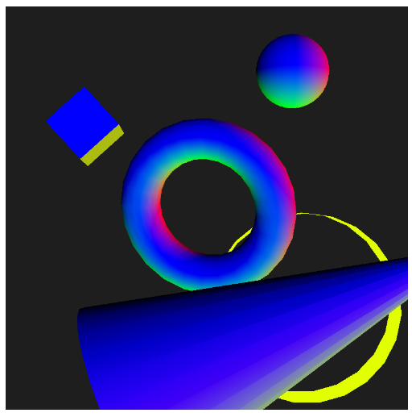

# **Reflective Journal**

## 2026-09-14
Before I didn't really play around with markdown. I knew its existence, but I never bothered to use it. Simply because I learned many programming languages, frameworks and whatnot. So I didn't really think about using markdown at some point up until now in this course. Honestly, I find it cool, easy to use and practical when it comes to design a simple website. It even allows people with no previous programming skills to build a website. Granted, I feel markdown is very limited and one cannot do a lot of customization to the website. Thus, I felt very limited by it. It felt like hitting my head with a wall. For that reason I started to search online for a way to customize the website while  always using markdown. I read online that it is possible to combine HTML tags and markdown. While it is true, to my surprise, it did not work as I thought it would be. For example, at some point I used a lot of HTML tags to make small customizations to the website, specially to the banner that I am using in the website. When I was seeing the changes on VSCode I actually liked how everything looked. But after I pushed to the repo, I noticed that the changes were being reflected in the repo itself, but the changes weren't being reflected in the website at all. Eventually, I hope to make this website look a bit better visually and appealing to the eyes.

## 2026-09-23
Before I never used and heard about this P5 library from JavaScript. After playing around with P5 while doing three prototypes (plus one previous course work) I can conclude that this is really cool. What I mean is that it allows to create from easy to complex creative prototypes while not hindering a lot the creative process of someone. What I also find nice is that the documentation it is well explained and easy to follow. However, I still think that I have so much to learn about it. Regarding  my prototypes, specifically the second and third, I do not expect people to understand them at all. Really, they are up to any interpretation. Prototype number two looks really abstract in my opinion. I did explain in the code what I had in mind while doing it. Also, I have to say that the prototype number three was made as something "funny". But now that I think about it, it reminds me a lot of the logo from Nintendo64 (that was not on purpose by the way). The third prototype is really random which I like a lot. What I am still thinking about is the fact that I could not make images or text work when my canvas included the WEBGL for 3D models. I would like to go back to that after and try to make it work. I could not make my idea for that prototype because of those methods not working at all with the 3D objects.

