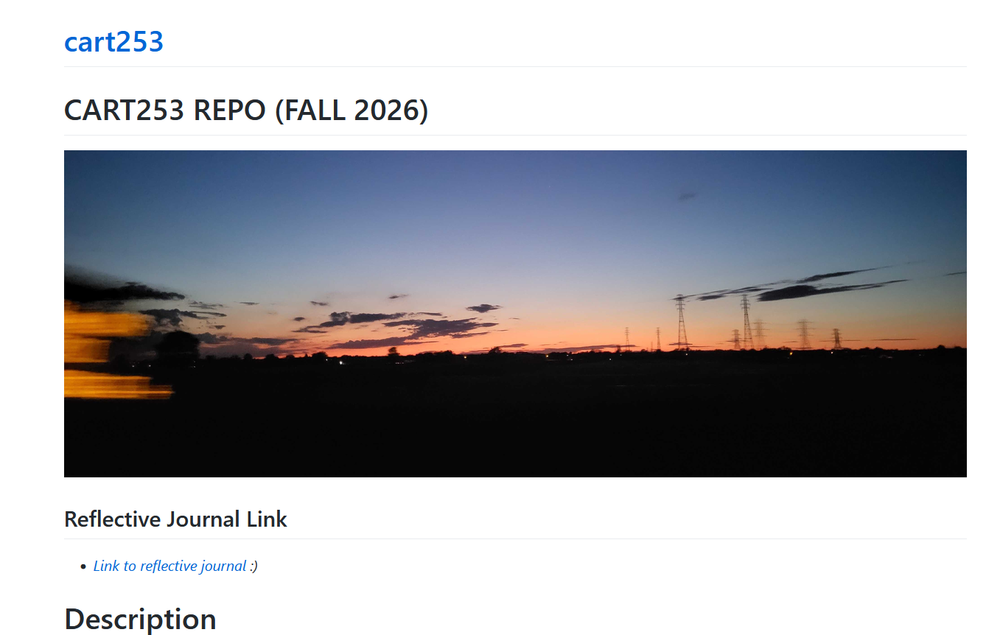
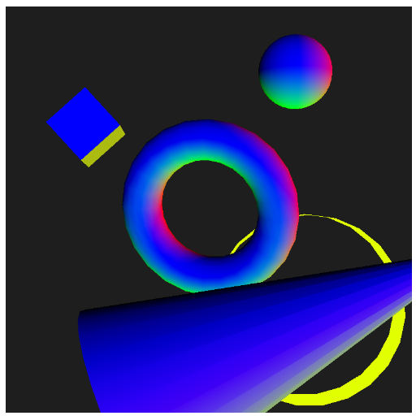
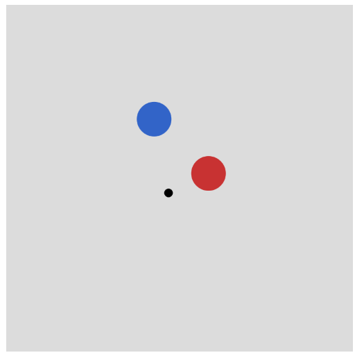

# **Reflective Journal**

## 2026-09-14
Before I didn't really play around with markdown. I knew its existence, but I never bothered to use it. Simply because I learned many programming languages, frameworks and whatnot. So I didn't really think about using markdown at some point up until now in this course. Honestly, I find it cool, easy to use and practical when it comes to design a simple website. It even allows people with no previous programming skills to build a website. Granted, I feel markdown is very limited and one cannot do a lot of customization to the website. Thus, I felt very limited by it. It felt like hitting my head with a wall. For that reason I started to search online for a way to customize the website while  always using markdown. I read online that it is possible to combine HTML tags and markdown. While it is true, to my surprise, it did not work as I thought it would be. For example, at some point I used a lot of HTML tags to make small customizations to the website, specially to the banner that I am using in the website. When I was seeing the changes on VSCode I actually liked how everything looked. But after I pushed to the repo, I noticed that the changes were being reflected in the repo itself, but the changes weren't being reflected in the website at all. Eventually, I hope to make this website look a bit better visually and appealing to the eyes.

## 2026-09-23
Before I never used and heard about this P5 library from JavaScript. After playing around with P5 while doing three prototypes (plus one previous course work) I can conclude that this is really cool. What I mean is that it allows to create from easy to complex creative prototypes while not hindering a lot the creative process of someone. What I also find nice is that the documentation it is well explained and easy to follow. However, I still think that I have so much to learn about it. Regarding  my prototypes, specifically the second and third, I do not expect people to understand them at all. Really, they are up to any interpretation. Prototype number two looks really abstract in my opinion. I did explain in the code what I had in mind while doing it. Also, I have to say that the prototype number three was made as something "funny". But now that I think about it, it reminds me a lot of the logo from Nintendo64 (that was not on purpose by the way). The third prototype is really random which I like a lot. What I am still thinking about is the fact that I could not make images or text work when my canvas included the WEBGL for 3D models. I would like to go back to that after and try to make it work. I could not make my idea for that prototype because of those methods not working at all with the 3D objects.

## 2026-09-30
When doing this assignment I learned about this method from p5 called dist() that is used to calculate the distance between two points. While also making more use of the constraint method() which helped me to create constraints for some items that were in my prototypes. I still find p5 to be fun to use and not that limiting to one's idea. I have to say and admit that even though I have been having fun doing these prototypes, my impostor syndrome kicks in and it reminds me that I do not enjoy coding a lot (mostly because I had experience with it before, but in a context of building 3 tier apps and microservices). Anyway, I still need more practice regarding the mathematical aspects. For example, when making an object move, or collide with something, etc. Sometimes during the process I get confused or even frustrated when I do not get the result I wanted. In the same manner sometimes I find a helpful solution online for my specific problem, but it happens that the answer doesn't answer my real doubt. Like it fixes my coding problem, but the problem goes beyond coding. It's a matter of "I need to understand the "why" behind the solution". Moving on, I would like to develop more in the idea of the magnets because that prototype was something that came out of a time when I was playing a video game and some little NPC characters were following my playable character around. So I would like to make that idea instead of the magnets, just for fun.

## 2026-10-07
I kind of started implementing more using objects and its variables (evidently this change comes from previous feedback and the class we had on this topic). I like this approach because the code looks cleaner and it does not have numbers or names flying around the whole code. It reminds me a lot (and flashbacks) from Object Oriented Programming in Java. I ran into a problem in my first prototype code. I could not add an image even thought I had the correct path. I even tried putting my image alone in a canvas and I was not getting any result. Why did I brought this up? Because in that specific prototype, when interacting with it, one can get "Mike Wazowski" as an option from the mystery box; so evidently I wanted to make an image of him appear after the box was opened. Unfortunately I could not make it work at all. I later on realized that I may need the Live Server extension in order to make them work (I usually ran the index file from my file explorer).  I would say this time I felt less frustrated with my prototypes. Could it be because they seem easier? Also, I should give more time to prototypes in order to develop them a bit more. Coming back to the new prototypes, I would like to revisit the button and mystery gift prototypes. I thought that probably those two prototypes can be further develop to make a small interactive game.